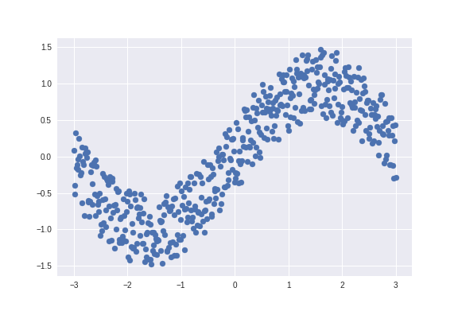
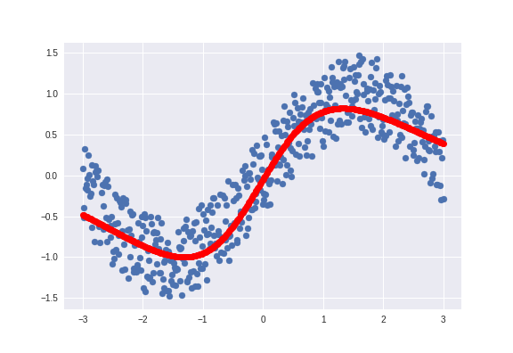
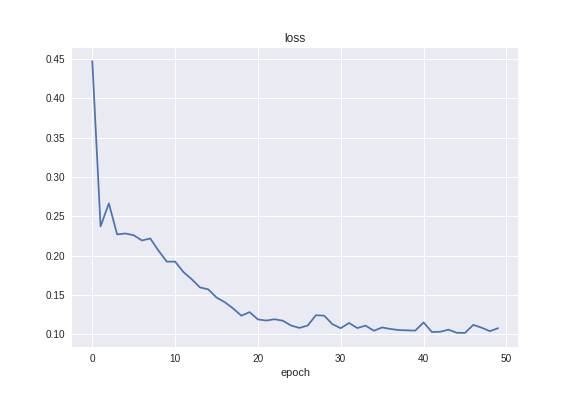

# neural_network

Implement Machine Learning Algorithms to Classify Data

This repository contains various Python files that demonstrate the power of machine learning. 

## deep_neural_network.py

Uses `Keras` to perform multi-class logistic regression

## logistic_regression.py

Use batch gradient descent to separate between two output types

## multiclass.py

Uses `Keras` to differentiate data between 5 different output classes 

## perceptron.py

Uses `Keras` to perform logistic regression

## Polynomial_Regression.ipynb

Uses polynomial regression on a sinusoidal curve 

### Input Sine Signal

### Output of Polynomial Regression

### Loss plotted over epochs

